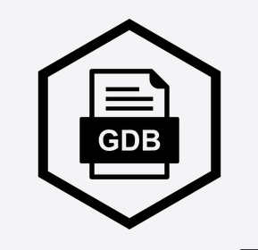

# 👋 Hi, I'm Adriano

🎓 Cybersecurity student | 🔴 Offensive & Defensive Security | 🕹️ Passionate about CTFs, Pentesting & Cyber Defense  
⚗️ Looking for opportunities in cybersecurity (internship/job)  

<!-- 
## 🌐 Connect with me
  
  
📧 [Email me](mailto:ton.email@example.com) 
-->

## 🛠️ Skills & Tools

### Programming Languages

  
  
  
  

---

### Reverse Engineering & Debugging

  
  

---

### DevOps & Infrastructure

  
  
  
  

---

### Databases

  
  
  

## Featured Projects
🔹 [**Spider & Scorpion**](https://github.com/username/repo) – Recursive image downloader & metadata analyzer (Python)  
🔹 [**CTF Writeups**](https://github.com/username/repo) – Organized solutions & explanations from CTF challenges  
🔹 [**K3d + ArgoCD GitOps**](https://github.com/username/repo) – Automated Kubernetes GitOps deployment  

## Fun Facts
- 🕵️ Regularly practicing on Hack The Box & CTF platforms  
- ⚡ Always curious about system internals & low-level programming  

<!--
Here are some ideas to get you started:

- 🔭 I’m currently working on ...
- 🌱 I’m currently learning ...
- 👯 I’m looking to collaborate on ...
- 🤔 I’m looking for help with ...
- 💬 Ask me about ...
- 📫 How to reach me: ...
- 😄 Pronouns: ...
- ⚡ Fun fact: ...
-->
